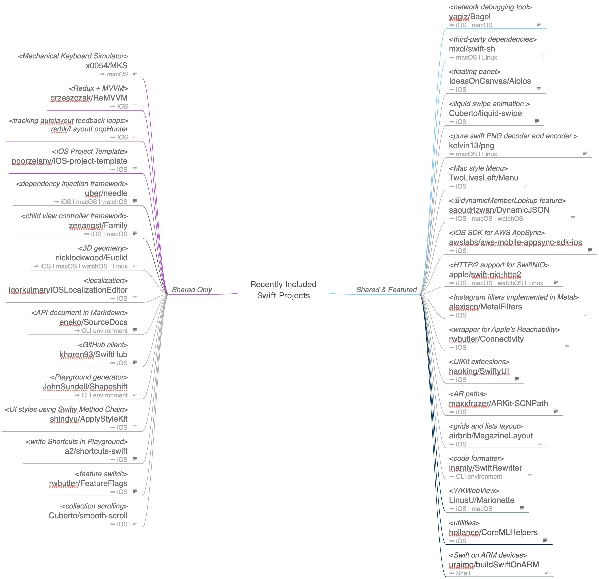

# Recently Included Swift Projects

## *Shared & Featured*

- <*AWS SDK*>
swift-aws/aws-sdk-swift
➟ macOS | Linux 

	支持 macOS 和 Ubuntu 的 AWS SDK。

- <*3D Picture Gallery Slideshow*>
folio-sec/Slideshow
➟ macOS 

	采用 SceneKit 写的 3D 动态图片墙。酷！不过系统资源消耗也很历害。

- <*Metrics API*>
apple/swift-metrics
➟ iOS | macOS | Linux

	苹果开源并逐步固定 Metrics API，以方便用户对应用的运行及资源状态进行有效跟踪。

- <*converts between AttributedStrings and HTML*>
IdeasOnCanvas/Ashton
➟ iOS | macOS

	MindNode 团队开发使用的 NSAttributedStrings 和 HTML 高性能互转类库。

- <*handy features to standard library*>
*Flinesoft/HandySwift*
➟ iOS | macOS | Linux

	由于某些原因 Swift 标准库仍未收入且很好用的功能特性扩展。

- <*Codable extension*>
JohnSundell/Codextended
➟ macOS | Linux

	为自定义 Codable 而生的扩展 API。

- <*dependency manager*>
JamitLabs/Accio
➟ macOS

	结合 SwiftPM，为 Carthage 锦上添花的包管理命令行工具。

- *<string scanning library>*
JohnSundell/Sweep
➟ iOS | macOS | Linux

	比正则表达式简单很多的子字符串扫描和匹配。

- <*Declarative UI construction*>
square/Blueprint
➟ iOS

	Square 公司开源的自用声明式 UI 开发框架库。

- <*loading*>
farshadjahanmanesh/loady
➟ iOS

	常用可定制载入进程按钮动画。

- <*science-journal*>
google/science-journal-ios
➟ iOS

	Google 科学日志 iOS 版应用开源。

- <*CLI tool*>
rockbruno/SwiftInfo
➟ macOS

	命令行工具跟踪检查 iOS 应用版本代码级变化。

- <*hand-drawn, comic shape*>
onmyway133/RoughSwift
➟ iOS

	编程方式创建手绘和漫画风格画面。酷炫！

## *Shared Only*

- <*animated switch*>
d-dotsenko/DDAnimatedSwitch
➟ iOS 

	把开关动画定制到可乐。

- <*execute Swift into markdown*>
objcio/markdown-playgrounds
➟ macOS 

	在 Markdown 中执行 Swift Playgrounds 代码。这是想让 Markdown 编辑器无敌的节奏吗？

- <*native source editor*>
twostraws/Sourceful
➟ iOS | macOS 

	有了这个支持，是时候写一款 iOS/macOS 通用的源代码编辑器了。

- *<TouchBar extension>
pigigaldi/Pock*
➟ macOS

	将 macOS Dock 放入 Touch Bar。总得来讲是 Touch Bar 的有益补充，设计思路及程序结构也恰到好处。

